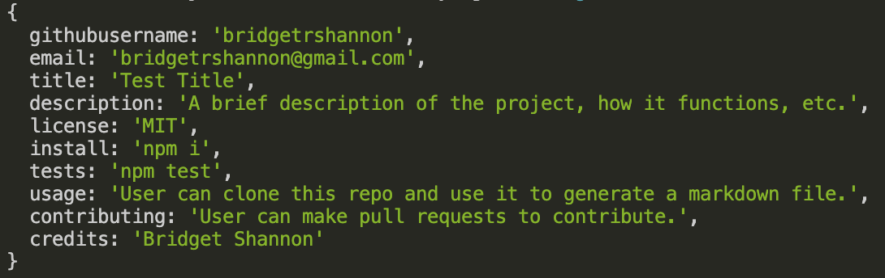
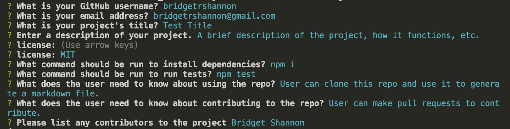

  # Readme Generator

  ## Description
  - Readme Generator is a command-line application that dynamically generates a professional README.md file from a user's input using the Inquirer package.

  ## Features
  - Users can type answers to a series of questions regarding their project (title, description, usage, license, etc.)
  
  - When the user has answered all the questions, a generateMarkdown.md file will be created with their response.
  
### Gif Demonstrations
 